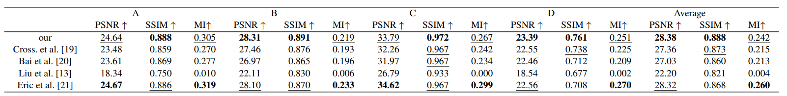
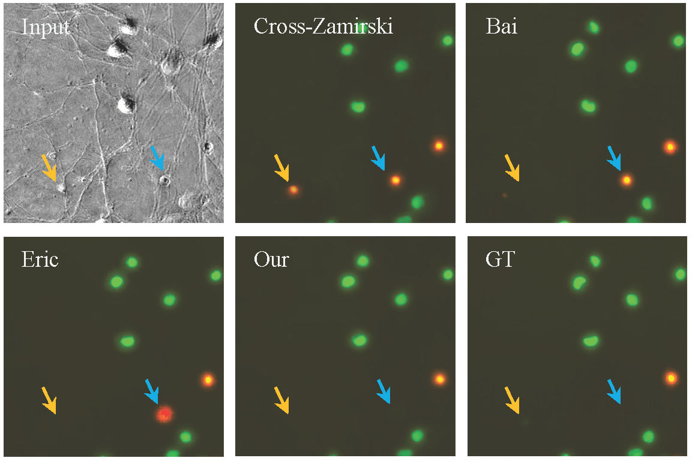
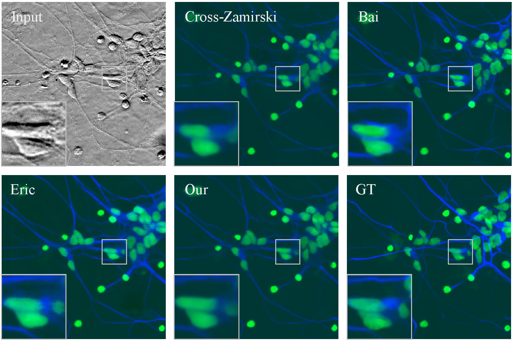

# An efficient swin-transformer model for multi-style virtual staining of microscopy images

This is the offical implementation of xxx.

## Introduction

Microscopy can reveal cellular structures, which is very important for life science. Fluorescence
Recently, deep learning has been used to virtually stain unlabeled biomedical images to avoid the physical staining proce
Here, we propose a novel swin-transformer-based model for
virtual staining tasks.

### Framework


## Main Results

Virtually stained images by different methods.

### Statistical Results


### Nuclei


### Dead cells



### Neurons




## Usage

This project is based on the following projects:  

* https://github.com/microsoft/Swin-Transformer
* https://github.com/JingyunLiang/SwinIR

### Requirements

* torch == 1.12.1
* timm == 0.6.11

### Install

- Clone this repo:

```bash
git clone https://github.com/birkhoffkiki/CAS-Transformer.git
cd WORK_DIRCTORY
```

### Data preparation

We use three different datasets in this projects and you can download them from following addresses.  
* ISL dataset: https://github.com/google/in-silico-labeling/blob/master/data.md 
* BCI dataset: https://bupt-ai-cz.github.io/BCI/
* Aperio-Hamamatsu dataset: https://github.com/khtao/StainNet

#### ISL dataset process:  

Download data and save them to ```data/ISL/``` directory.

```bash
cd data/scripts
python crop_patches.py --data_type test
python crop_patches.py --data_type train
python virtual_split_images.py --data_type test
python virtual_split_images.py --data_type train
# check data integrity, see check_data_integrity.py
```

#### BCI dataset
Download this dataset and unzip them to ```data/BCI``` directory.

#### Aperio-Hamamatsu dataset
Download this dataset and unzip them to ```data/Aperio``` directory.

### Pretrain the model

```bash
# the config file is located at configs/pretrian.yaml
# you can change the parameters based on your own situations
# remeber to change the path set in the config file
bash pretrain.sh
```

### Train the model

train the model on the ISL dataset  

```bash
# the config file is located at configs/ISL/train.yaml
# you can change the parameters based on your own situations
# remeber to change the path set in the config file
bash train_isl.sh
```
train the model on the BCI dataset

```bash
# the config file is located at configs/BCI/train.yaml
# you can change the parameters based on your own situations
# remeber to change the path set in the config file
bash train_bci.sh
```

train the model on the Aperio-Hamamatsu dataset

```bash
# the config file is located at configs/AperioData/train.yaml
# you can change the parameters based on your own situations
# remeber to change the path set in the config file
bash train_aperio.sh
```

### Evaluate and predict

evaluate ISL dataset

```python
# attention the path of dataset
python predict_isl.py
```

evaluate BCI dataset
```python
# attention the path of dataset
python predict_bci.py
```

evaluate Aperio dataset
```python
# attention the path of dataset
python predict_aperio.py
```

## contact

if you have any questions, please feel free to contact me:  

* JIABO MA, jmabq@connect.ust.hk