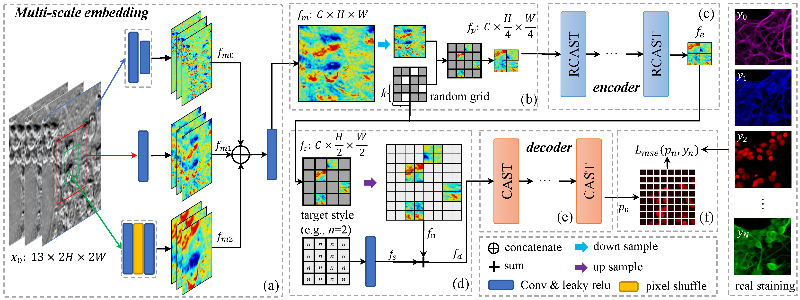

# Efficient Supervised Pretraining ofSwin-transformer for Virtual Staining of Microscopy Images

## Introduction

This project is based on the following projects:  

* https://github.com/microsoft/Swin-Transformer
* https://github.com/JingyunLiang/SwinIR

### Framework of our method



## Usage

### Requirements

* torch == 1.12.1
* timm == 0.6.11

### Install

- Clone this repo:

```bash
git clone https://github.com/birkhoffkiki/CAS-Transformer.git
cd WORK_DIRCTORY
```

### Data preparation

We use three different datasets in this projects and you can download them from following addresses.  
* ISL dataset: https://github.com/google/in-silico-labeling/blob/master/data.md 
* BCI dataset: https://bupt-ai-cz.github.io/BCI/
* Aperio-Hamamatsu dataset: https://github.com/khtao/StainNet

#### ISL dataset process:  

Download data and save them to ```data/ISL/``` directory.

```bash
cd data/scripts
python crop_patches.py --data_type test
python crop_patches.py --data_type train
python virtual_split_images.py --data_type test
python virtual_split_images.py --data_type train
# check data integrity, see check_data_integrity.py
```

#### BCI dataset
Download this dataset and unzip them to ```data/BCI``` directory.

#### Aperio-Hamamatsu dataset
Download this dataset and unzip them to ```data/Aperio``` directory.

### Pretrain the model

```bash
# the config file is located at configs/pretrian.yaml
# you can change the parameters based on your own situations
# remeber to change the path set in the config file
bash pretrain.sh
```

### Train the model

train the model on the ISL dataset  

```bash
# the config file is located at configs/ISL/train.yaml
# you can change the parameters based on your own situations
# remeber to change the path set in the config file
bash train_isl.sh
```
train the model on the BCI dataset

```bash
# the config file is located at configs/BCI/train.yaml
# you can change the parameters based on your own situations
# remeber to change the path set in the config file
bash train_bci.sh
```

train the model on the Aperio-Hamamatsu dataset

```bash
# the config file is located at configs/AperioData/train.yaml
# you can change the parameters based on your own situations
# remeber to change the path set in the config file
bash train_aperio.sh
```

### Evaluate and predict

evaluate ISL dataset

```python
# attention the path of dataset
python predict_isl.py
```

evaluate BCI dataset
```python
# attention the path of dataset
python predict_bci.py
```

evaluate Aperio dataset
```python
# attention the path of dataset
python predict_aperio.py
```

## Main Results

### Performance on the ISL dataset

|  Conditions  |     A     |     A     |     B     |     B     |     C     |     C     |     D     |     D     |    Avg    |    Avg    |
|:------------:|:---------:|:---------:|:---------:|:---------:|:---------:|:---------:|:---------:|:---------:|:---------:|:---------:|
|              |    PSNR   |    SSIM   |    PSNR   |    SSIM   |    PSNR   |    SSIM   |    PSNR   |    SSIM   |    PSNR   |    SSIM   |
|      our     |   24.64   | **0.888** | **28.31** | **0.891** |   33.79   | **0.972** | **23.39** | **0.761** | **28.38** | **0.888** |
| [cross et al.](https://link.springer.com/content/pdf/10.1038/s41598-022-12914-x.pdf) |   23.48   |   0.859   |   27.46   |   0.876   |   32.26   |   0.967   |   22.55   |   0.738   |   27.36   |   0.873   |
|  [Bai et al.](https://downloads.spj.sciencemag.org/bmef/2022/9786242.pdf)  |   23.61   |   0.869   |   26.97   |   0.865   |   31.97   |   0.967   |   22.46   |   0.712   |   27.03   |   0.860   |
|  [Liu et al.](https://ieeexplore.ieee.org/stamp/stamp.jsp?arnumber=8964264)  |   18.34   |   0.750   |   22.11   |   0.830   |   26.79   |   0.933   |   18.54   |   0.677   |   22.20   |   0.821   |
| [Eric et al.](https://www.sciencedirect.com/science/article/pii/S0092867418303647)  | **24.67** | 0.886     | 28.10     | 0.870     | **34.62** | 0.967     | 22.56     | 0.708     | 28.32     | 0.868     |

### Performance on the BCI dataset

|      | [Liu et al.](https://ieeexplore.ieee.org/stamp/stamp.jsp?arnumber=8964264)  | [Zhu et al.](http://openaccess.thecvf.com/content_ICCV_2017/papers/Zhu_Unpaired_Image-To-Image_Translation_ICCV_2017_paper.pdf)  | [Isola et al.](https://openaccess.thecvf.com/content_cvpr_2017/papers/Isola_Image-To-Image_Translation_With_CVPR_2017_paper.pdf)  | [Bai et al.](https://downloads.spj.sciencemag.org/bmef/2022/9786242.pdf)  |  Our  |
|:----:|:-----------:|:-----------:|:-------------:|:-----------:|:-----:|
| PSNR |    18.90    |    17.57    |     19.93     |    21.45    | 22.21 |
| SSIM |    0.602    |    0.517    |     0.528     |    0.529    | 0.566 |

### Performance on the Aperio-Hamamatsu dataset

|      | StainNet | StainGAN | reinhard | vahadane | Bai et al.  |    Our    |
|:----:|:--------:|:--------:|:--------:|----------|:-----------:|:---------:|
| PSNR |   22.50  |   22.40  |   22.45  | 21.62    |    24.09    | **24.84** |
| SSIM |   0.691  |   0.703  |   0.638  | 0.659    |    0.754    | **0.768** |

## contact

if you have any questions, please feel free to contact me:  

* JIABO MA, jmabq@connect.ust.hk